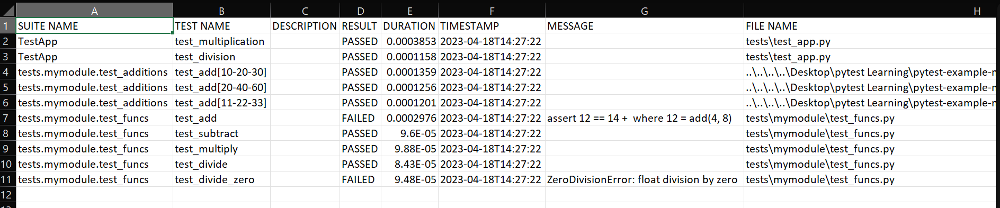
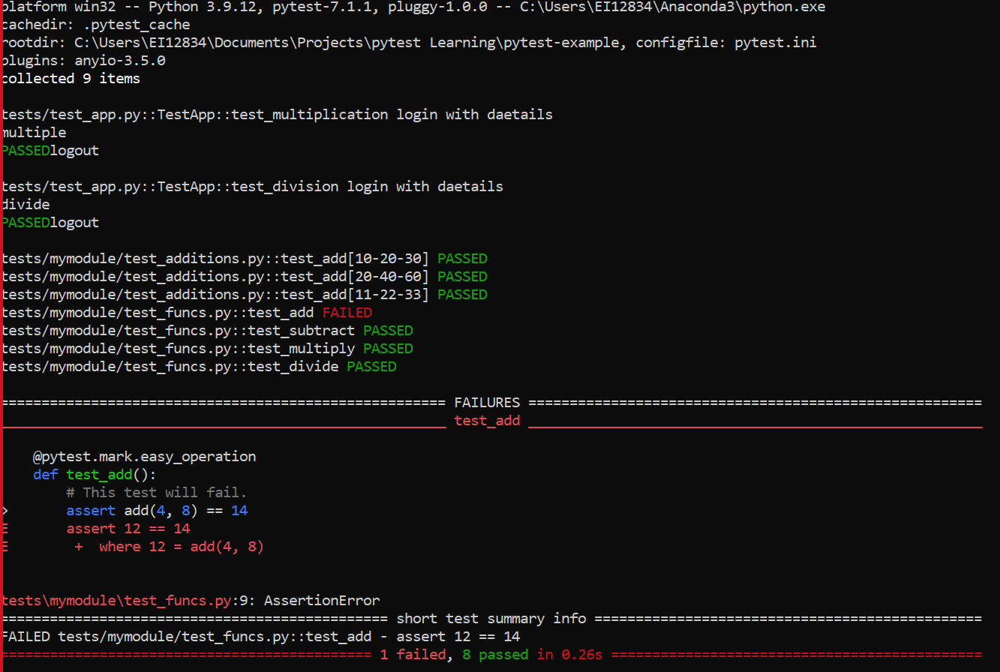

# pytest-example With Reporting 
Pytest is a powerful testing framework for Python that can help you easily integrate testing into your Python application. Here is a simple example of how to use pytest to write and run tests for your Python code.


# Installation
To install pytest, pytest-html, and pytest-excel, run the following commands:
```
pip  install pytest
pip install pytest-html
pip install pytest-excel
```


   
# Code Structure

```
myapp/
    app.py
    mymodule/
        __init__.py
        funcs.py
tests/
    __init__.py
    test_app.py
        mymodule/
            __init__.py
            test_additions.py
            test_funcs.py
```

 
# Generating Reports
To generate an HTML report, use the following command:
``` 
pytest -l --tb=long  --capture sys -rP -rF --html=test.html 
```

HTML  


[Example HTML](test.html)


To generate an Excel report with a filename that includes a timestamp, use the following command:
```
 pytest -l --tb=long  --capture sys -rP -rF --excelreport=report%Y-%m-%dT%H%M.xlsx 
 ```


[Example Excel](report2023-04-18T1731.xlsx)

To generate report on terminal, use the following command :
```
pytest
```
Terminal

# INI Configuration file 
This file is used to configure marker labels, and the options given to pytest can be specified in this file instead of providing them through the command line.

Below is simple example

```
[pytest]
addopts = -rA -q
markers =
    easy_operation: mark an easy mathematical operation.
    difficult_operation: mark a difficult mathematical operation.
```

# Fixtures
In pytest, a fixture is a function that provides a fixed baseline for your tests. It allows you to set up preconditions that your tests depend on, such as setting up a database connection or creating test data. Fixtures are defined using the `@pytest.fixture` decorator, and they can be used by including the fixture function as an argument to your test functions.

Here's an example of a fixture that sets up a database connection:
```
import pytest
import psycopg2

@pytest.fixture
def db_conn():
    conn = psycopg2.connect(host="localhost", dbname="mydb", user="myuser", password="mypassword")
    yield conn
    conn.close()

def test_query(db_conn):
    cursor = db_conn.cursor()
    cursor.execute("SELECT * FROM users")
    result = cursor.fetchall()
    assert len(result) > 0

```
In this example, the `db_conn` fixture sets up a database connection and yields it to the test function. The `yield` statement allows the test function to use the fixture, and then closes the connection when the test is finished.

# Markers
Markers in pytest are used to mark specific tests with a label or category. This can be useful for running a subset of tests that belong to a certain category, such as integration tests or slow tests. Markers are defined using the `@pytest.mark` decorator, and they can be used to select tests using the `-m` option when running pytest.

Here's an example of how to use markers in pytest:
```
import pytest

@pytest.mark.fast
def test_addition():
    assert 1 + 1 == 2

@pytest.mark.slow
def test_multiplication():
    assert 10 * 10 == 100

```
In this example, we have marked two tests with the fast and slow markers, respectively. We can run just the fast tests using the following command:
```
pytest -m fast

```
This will only run the `test_addition` test.

Markers can also be used in combination with fixtures to create more complex test scenarios. For example, you could mark a test as requiring a specific fixture like this:
``` 
import pytest

@pytest.fixture
def my_fixture():
    return "foo"

@pytest.mark.usefixtures("my_fixture")
def test_my_test():
    assert True

````
In this example, the `test_my_test` function is marked with the `usefixtures` marker, which tells pytest to use the `my_fixture` fixture when running the test.

In our Example we can run the marker with the following command 

``` 
pytest -m difficult_operation 
```

### Markers used in projects 

```
>pytest --markers
@pytest.mark.easy_operation: mark an easy mathematical operation.
@pytest.mark.difficult_operation: mark a difficult mathematical operation.
```